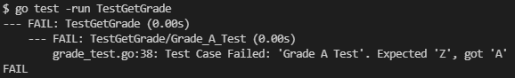
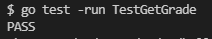
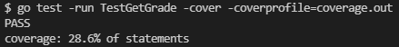
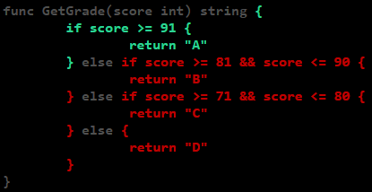
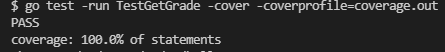
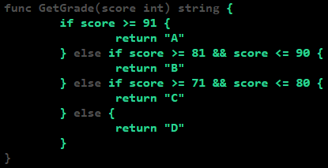

In this first post, I am going to write about basic unit test in Go language. There will be 4 main sections. 
1. General information about unit test
2. How to create a simple unit test
3. How to run a unit test
4. Useful unit test commands

## What is unit test?
Unit test is an isolated and individual code test which is used to validate whether the code, function, method, procedure, module, or object behaves as expected or not. Good engineers write unit test of their own code during the development process. In software testing, unit test is considered to be the first part of the whole testing process as it is the simplest and easiest form of test that can be done in a local machine.

## Why is Unit Test important?
Unit test is important because it can prevents bugs, flaws or unexpected code behavior that might happen during runtime. An engineer can simply read a well written unit test to understand what the function does and how it works. That means unit test contributes in improving code readability and documentation which benefits engineers. The isolated and individual behavior of unit test also provides a robust and easy way to do testing. 

## Pros of Unit Test
- Provide code functionality validation
- Can be reused and run multiple times
- Useful when refactoring and migrating code
- Increase code readability
- Can be used as code documentation

## Cons of Unit Test
- Require more development time to create initially
- Does not cover integration and system test
- Does not catch every possible error of a program (Not a crystal ball)

## Creating a Unit Test
Here is a simple function which produces a grade from a score input.
```go
// filename: grade.go
func GetGrade(score int) string {
	if score >= 91 {
		return "A"
	} else if score >= 81 && score <= 90 {
		return "B"
	} else if score >= 71 && score <= 80 {
		return "C"
	} else {
		return "D"
	}
}
```
Let me ask you a question. How do you make sure the code works well without running the program? This is where unit test comes in handy.

We can start by creating a new file. Let's name it `grade_test.go` and save it on the same directory as `grade.go` . In Go language, unit test code needs to be placed inside `_test.go` file. Once the file is created, we can write a function that starts with `Test` prefix. I usually follow the name of the function that we want to test. So the function name will be `TestGetGrade` . The function needs to pass built in Go testing library `*testing.T` . Then I start by creating test cases in an array of structs. 

```go
filename: grade_test.go
func TestGetGrade(t *testing.T) {
	testCases := []struct {
		name           string
		input          int
		expectedOutput string
	}{
		{
			name:           "Grade A Test",
			input:          95,
			expectedOutput: "Z",
		},
	}
}
```

- `name` attribute is used to label the test case.
- `input` attribute is used for the parameter of the function. It can be modified to a struct if there is more than one parameters in the function.
- `expectedOutput` attribute is used for the output of the function. It can be modified to a struct if there is more than one outputs in the function.

After that we need to loop these test cases. Inside each loop, we will call the function and validate the output with our expected output. If the function output is not the same as the expected output, then the test will throw an error. 

```go
filename: grade_test.go
func TestGetGrade(t *testing.T) {
	testCases := []struct {
		name           string
		input          int
		expectedOutput string
	}{
		{
			name:           "Grade A Test",
			input:          95,
			expectedOutput: "Z",
		},
	}

    for _, tc := range testCases {
		t.Run(tc.name, func(t *testing.T) {
			actual := GetGrade(tc.input)

			if actual != tc.expectedOutput {
				t.Errorf("Test Case Failed: '%s'. Expected '%s', got '%s'", tc.name, tc.expectedOutput, actual)
			}
		})
	}
}
```
Now we have a unit test code. Let's try to run it and see the test result.

## How to run a Unit Test
We can run a unit test of a specific function by using command line or through the built in function of an IDE. In this article, I will run unit test using command line as different IDE might have different set of commands.

Before running any command, make sure you are inside the same directory of the `grade.go` and `grade_test.go`
```bash
go test -run TestGetGrade
```
We use built in `go` command to run the unit test. This command will run `TestGetGrade` function only. It's easy and simple right! Here is the result. 


Yes the unit test failed but it is expected. We always want to run a failing test first to ensure the unit test code works as expected. Based on the logs, we can see that the expected test case output does not match the actual function output in test case name `Grade A Test`. Now let's fix the test case and run the unit test again. 


Yeah congratulations! We have successfully run a passing unit test. For the next part, I will try to introduce useful additional commands that will help us analyzing our unit test.

## Useful Unit Test commands
One important aspect of unit test is to make sure it has a code coverage as close to 100% as possible. Wait what is code coverage? So code coverage shows whether the unit test case created covered the whole parts of a function. That means a code coverage close to 100% shows the unit test is well written. Here is how to do it.
```bash
go test -run TestGetGrade -cover -coverprofile=coverage.out
go tool cover -html=coverage.out
```
The command `-cover` counts unit test coverage. While `-coverprofile` stores coverage calculations in coverage.out file. The result can be presented in a html page using the `-html` command.

Command line result

HTML result


On the command line result, we can see the percentage of the coverage. To illustrate them, we can simply run the `go tool` command and open the result in a browser. The green color indicates the unit test is covered while the red color is the opposite. Since we now know which part of the code that needs additional test case, let's add them and test the result

Command line result

HTML result


Voila! We have a 100% unit test code coverage. We can learn that having a passing unit test is not enough. We need to have a 100% unit test code coverage to make sure our code works as expected and prevent unwanted incidents. 

Anyway, if you need to run all unit tests in your project, you can use the command below. `-race` command runs the unit test concurrently using goroutine. That way if the unit test failed with Race Detected error, it means race condition might occur in your code. 


```bash
go test ./... -race -cover -coverprofile=coverage.out
```

## Full Code Example
```go
// filename: grade.go
package main

func GetGrade(score int) string {
	if score > 90 {
		return "A"
	} else if score > 80 && score <= 90 {
		return "B"
	} else if score > 70 && score <= 80 {
		return "C"
	} else {
		return "D"
	}
}
```
```go
// filename: grade_test.go
package main

import "testing"

func TestGetGrade(t *testing.T) {
	testCases := []struct {
		name           string
		input          int
		expectedOutput string
	}{
		{
			name:           "Grade A Test",
			input:          95,
			expectedOutput: "A",
		},
		{
			name:           "Grade B Test",
			input:          85,
			expectedOutput: "B",
		},
		{
			name:           "Grade C Test",
			input:          75,
			expectedOutput: "C",
		},
		{
			name:           "Grade D Test",
			input:          65,
			expectedOutput: "D",
		},
	}

	for _, tc := range testCases {
		t.Run(tc.name, func(t *testing.T) {
			actual := GetGrade(tc.input)

			if actual != tc.expectedOutput {
				t.Errorf("Test Case Failed: '%s'. Expected '%s', got '%s'", tc.name, tc.expectedOutput, actual)
			}
		})
	}
}
```

This is the end of my first blog post. Hopefully you find it useful. I really appreciate if can give me any feedbacks or comments. Please do contact me by visiting the link in the [about](https://classified5.github.io/about/) page. Thank you.